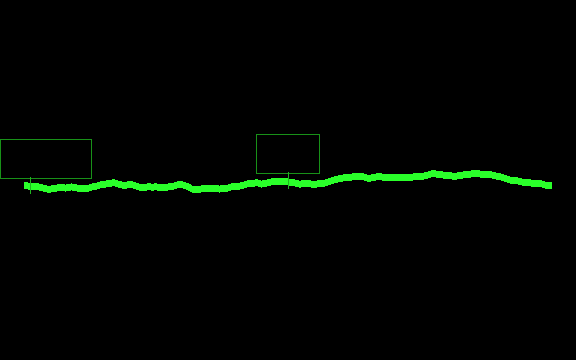

# 峰ミル

SABERA スマートグラスに、**目の前の山並みへ稜線と山名を重ねる** Android アプリ。

平地から遠景を見るためのもの（鯖江から白山、甲府から富士山）。山頂での利用は考えていない。
**全国の地形を同梱している**ので、圏外でも動く。

星座版の姉妹アプリ **[星しるべ](https://github.com/jigintern/sabera-team-e)** から、
座標変換・グラス出力・姿勢補正を移植している。



同梱の標高データから焼いた、鯖江（35.94N, 136.18E）から方位 65.8° の稜線。
実データで、絵ではない。**緑の細い箱は山名が入る位置** —— 名前は画像に焼かず、
グラスのテキスト枠として別に送る（パネルは緑 8 階調しか出せず、
文字はファームが持つ書体で描くほうが読めるため）。

## 何が難しいのか

**星と山は座標系のほかに何も共有しない。** 星は無限遠にあって互いを隠さないが、
**山は有限距離にあって互いを隠す。** この一点が設計の大半を決めている。

鯖江の 150km 圏には 185 座あるが、**実際に見えるのは 10 座**しかない。
残りは手前の山の裏に沈んでいる。だから山ごとに個別の見通しを引いて、
隠れているものは描かない。

| 制約 | 数字 |
|---|---|
| パネル | 576 × 360・**緑 8 階調（3bit）・黒は透明** |
| 画像バッファ | 380,000 バイト（`幅 × 高さ × 2 + 圧縮後`） |
| 文字 | **8 枠・合計 190 バイト**（画面全体の合計であって 1 回ぶんではない） |
| 転送 | 528×330 の 1 枚で 332〜390ms |
| 方位の基準 | **無い。** 磁力計を積んでいないので、ヨーは静止中も −44°/分 流れる |

黒が透明なので、**光った画素はそのまま実景の山に重なる**。
だから塗りつぶさない（本物の山を隠す）し、細線にもしない（屋外の空に負ける）。
最上段の階調だけを使って線幅で存在感を稼ぐ。

全画面をなめらかに動かすのは原理的に無理なので、**首が止まったときだけ送り直す。**

## いまどこまで

**実機で確かめたものと、JVM テストしか通っていないものを分けて書く。**
[AGENTS.md](AGENTS.md) の「確かめていないことを『動く』と書かない」に従う。

| | 状態 |
|---|---|
| 稜線をグラスに出す | ✅ **実機で確認済み** |
| 山名を 7 枠に載せる | JVM のみ。**実機未確認** |
| 方位マーク（N/E/S/W） | JVM のみ。**実機未確認** |
| 首を振ると稜線が付いてくる | **実機未確認** |
| 方位合わせ（スマホ十字 → 稜線合わせ） | **実機未確認** |

**画角は未実測。** `ObservationDefaults.FOV_DEG = 35.0` は星しるべから引き継いだ仮値で、
稜線合わせの 2 段目が通れば実測値に置き換わる。**それまで「合わせた」と書かない。**

**屋外の昼に緑 8 階調が見えるかも未実測。** 星しるべにも夜の実測しかない。

詳しくは [docs/STATUS.md](docs/STATUS.md)。ここが最新の真実。

## 動かす

必要なもの:

- JDK 17
- Android SDK（compileSdk 36）と **BLE の載った実機**（エミュレータでは動かない）
- SABERA SDK を取る GitHub Packages の資格情報

SDK は `jig-SABERA/sabera-sdk-packages` から取るので、`~/.gradle/gradle.properties` に
`read:packages` を持つトークンを置く:

```properties
GitHubPackagesUsername=<GitHubのユーザー名>
GitHubPackagesPassword=<Personal Access Token>
```

```bash
./gradlew :app:installDebug        # 実機へ入れる
./gradlew :app:testDebugUnitTest   # JVM テスト（実機不要）
```

> `./gradlew :app:lintDebug` は叩かない。AGP 8.7.0 と Kotlin 2.3.10 の非互換でクラッシュする。
> detector を切って通すのも禁止（[AGENTS.md](AGENTS.md)）。

初めて使うときは、**グラスの選び直しが要る**。星しるべとは `applicationId` が別なので、
BLE の紐付け（CompanionDeviceManager の association）は引き継がれない。

同梱データを作り直すとき（ふだんは不要。生成物はコミット済み）:

```bash
python3 tools/build-peak-catalog.py   # data/peaks.json（1003 山・百名山 100 座）
python3 tools/build-dem.py            # data/dem/（全国 z10・707 枚・18MB・外部取得あり）
```

現地でどの山に方位を合わせるかは、実データから表を出せる:

```bash
./gradlew :app:testDebugUnitTest --tests '*FieldNotesTest*' -i
```

## 中身

```
app/src/main/kotlin/jp/jig/glasses/sample/kmp/
├── geo/         座標・投影・大円距離・仰角
├── terrain/     見通し計算・遮蔽判定・見える山の洗い出し
├── tile/        同梱標高タイル（独自形式 MDM1）の読み出し
├── catalog/     山名カタログ
├── glass/       グラスへ出す 1 枚を焼く（稜線・山名・方位マーク）
├── alignment/   姿勢と方位合わせ（星しるべから移植）
└── ui/          ホーム → 接続 → 方位合わせ → 稜線
```

## ドキュメント

| 知りたいこと | 読む先 |
|---|---|
| **いまどこまで動いているか** | [docs/STATUS.md](docs/STATUS.md) |
| 何を作るか・なぜそう決めたか | [docs/PLAN.md](docs/PLAN.md) |
| 言葉の定義（**「稜線」と「尾根線」は別物**） | [CONTEXT.md](CONTEXT.md) |
| 実測値と、踏んだ落とし穴 | [docs/team-e/76_terrain-measurements.md](docs/team-e/76_terrain-measurements.md) |
| エージェント向けの規約 | [AGENTS.md](AGENTS.md) ・ [CLAUDE.md](CLAUDE.md) |

## 出典

同梱データはどちらも国土地理院のコンテンツで、
[国土地理院コンテンツ利用規約](https://www.gsi.go.jp/kikakuchousei/kikakuchousei40182.html)
に基づいて利用している。

| 資産 | 出典 | 加工 |
|---|---|---|
| `data/peaks.json` | 国土地理院「日本の主な山岳標高」 | 一覧から必要な列を取り出して JSON 化 |
| `data/dem/` | 国土地理院「地理院タイル（標高タイル）」 | **4m 量子化・int16 化・再圧縮** |

**標高タイルは元の分解能を保持していない。** 測量・航行・防災には使えない。

全文は [NOTICE](NOTICE)。出典はアプリのホーム画面にも出している。
